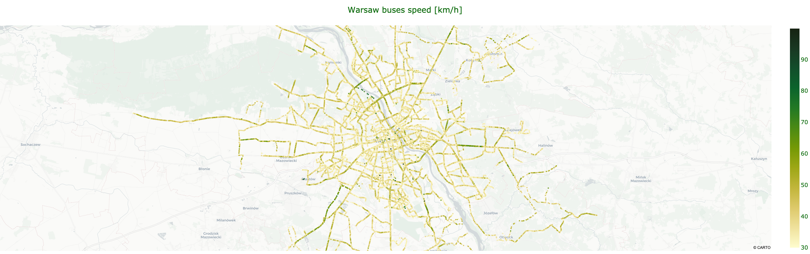
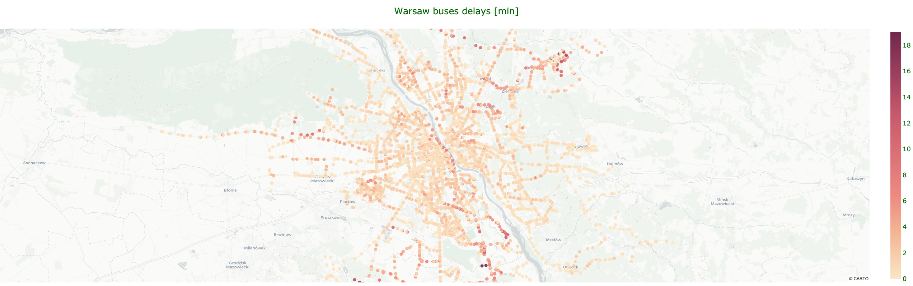

# Warsaw Bus analytic tools

Python package implementing fetching, computation and visualisation of data
related to Warsaw public bus transit. Implemented as a final project for
NYPD classes at University of Warsaw, February 2020.

## Fetching

### Positions

Positions are fetched by repetitive querying bus positions API. Script queries the 
API every 15 seconds, aggregates the results and removes the duplicates. Results
are then saved in the csv file.

```
# To fetch positions from given period of time
python main.py positions --api_key XYZ --file positions.csv --start "2021-02-10 16:00" --end "2021-02-10 18:00"
```

**Example data**

| Lines | Brigade | Lon        | Lat        | VehicleNumber | Time                |
|:-----:|:-------:|:----------:|:----------:|:-------------:|:-------------------:|
| 130   | 1       | 21.0841126 | 52.1676473 | 1001          | 2021-02-02 16:29:50 |
| 213   | 4       | 21.1004743 | 52.226027  | 1002          | 2021-02-02 16:29:51 |
| 213   | 2       | 21.214459  | 52.1616376 | 1003          | 2021-02-02 16:29:52 |

### Schedules

Schedules are fetched by first querying the API for all bus stops, then querying 
for lines visiting each stop, then for the detailed schedule of those lines.

Note, that the schedule may differ on the day of the script execution - it differs
between workdays and weekends.

```
# To fetch schedules
python main.py schedules --api_key XYZ --file schedules.csv
```

**Example data**

| Lines | Brigade | Lon        | Lat        | BusStopName   | Time     |
|:-----:|:-------:|:----------:|:----------:|:-------------:|:--------:|
| 123   | 4       | 21.044827  | 52.248455  | Kijowska      | 04:49:00 |
| 123   | 6       | 21.044827  | 52.248455  | Kijowska      | 05:19:00 |
| 123   | 357     | 21.044827  | 52.248455  | Kijowska      | 05:49:00 |

## Calculating

### Speeds

Speeds are calculated based on the previously fetched positions for a given 
time period. First position of a given bus is NaN, each consecutive is based 
on the distance traveled between data points of this bus.

Data is then visualized in the form of splatter map.

```
# To calculate speeds
python main.py speeds --file speeds.csv --positions positions.csv --start "2021-02-10 16:00" --end "2021-02-10 18:00"

# To just visualize previously calculated speeds 
python main.py speeds --file speeds.csv --dry
```

**Example data**

| Lines | Brigade | Lon        | Lat        | VehicleNumber | Time                | Distance | Speed  |
|:-----:|:-------:|:----------:|:----------:|:-------------:|:-------------------:|:--------:|:------:|
| 150   | 010     | 20.925739  | 52.310017  | 733           | 2021-02-02 17:00:08 | NaN      | NaN    |
| 150   | 010     | 20.927332  | 52.308876  | 733           | 2021-02-02 17:00:27 | 0.1671   | 31.661 |
| 150   | 010     | 20.927723  | 52.308624  | 733           | 2021-02-02 17:00:34 | 0.0386   | 19.901 |

**Example visualization**



On 2021-02-02 between 17:00:00 and 18:00:00 `555/1544` of the buses exceeded 
60 km/h at least once. Map suggests that it usually occurs on high-speed roads
and outside city centre.

### Delays

Delays are calculated based on both the previously fetched positions and schedules 
for a given time period. Arrival is based on the first occurrence of an adequate bus 
(determined by bus line and brigade) in the radius of 250 meters from the bus stop, 
considering only the arrivals at most 5 minutes before scheduled time.

```
# To calculate delays
python main.py delays --file delays.csv --positions positions.csv --schedules schedules.csv --start "2021-02-10 16:00" --end "2021-02-10 18:00"

# To just visualize previously calculated speeds 
python main.py delays --file delays.csv --dry
```

**Example data**

| Lines | Brigade | Lon        | Lat        | BusStopName          | Time                | Delay |
|:-----:|:-------:|:----------:|:----------:|:--------------------:|:-------------------:|:-----:|
| 109   | 3       | 20.980452  | 52.229405  | rondo Daszyńskiego   | 2021-02-02 17:37:00 | 2.0   |
| 109   | 3       | 20.970592  | 52.228602  | Szpital Wolski       | 2021-02-02 17:35:00 | 2.0   |
| 109   | 3       | 20.958139  | 52.227852  | PKP Wola (Kasprzaka) | 2021-02-02 17:33:00 | 1.0   |

**Example visualization**



On 2021-02-02 between 17:00:00 and 18:00:00 mean delay is just 1.34 minutes.

## Tests

Tests can be run using `pytest` command.

```
$ pytest --cov=warsawbus
====================== test session starts =====================================
platform darwin -- Python 3.6.8, pytest-6.2.1, py-1.10.0, pluggy-0.13.1
rootdir: /Users/abukala/IdeaProjects/bus
plugins: requests-mock-1.8.0, cov-2.11.1
collected 15 items
warsawbus/fetch/test_fetchers.py ............                            [ 80%]
warsawbus/statistics/test_calculators.py ...                             [100%]

---------- coverage: platform darwin, python 3.6.8-final-0 -----------
Name                                       Stmts   Miss  Cover
--------------------------------------------------------------
warsawbus/__init__.py                          4      0   100%
warsawbus/fetch/__init__.py                    4      0   100%
warsawbus/fetch/fetcher.py                    25     10    60%
warsawbus/fetch/position_fetcher.py           20      0   100%
warsawbus/fetch/schedule_fetcher.py           44      1    98%
warsawbus/fetch/test_fetchers.py              81      0   100%
warsawbus/statistics/__init__.py               4      0   100%
warsawbus/statistics/calculator.py            10      1    90%
warsawbus/statistics/delay_calculator.py      43      0   100%
warsawbus/statistics/speed_calculator.py      25      0   100%
warsawbus/statistics/test_calculators.py      40      0   100%
warsawbus/visualize/__init__.py                2      0   100%
warsawbus/visualize/plotter.py                40     27    32%
--------------------------------------------------------------
TOTAL                                        342     39    89%


======================== 15 passed in 4.20s ====================================
```

## Packaging

To build a source distribution run
```
python setup.py sdist
```

To install package run
```
pip install $PATH
```

#### Package requirements
```
geopy
pandas
numpy
plotly
pytest
```

